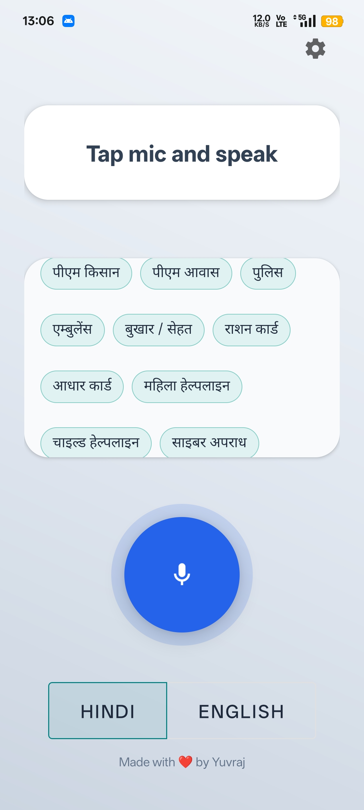
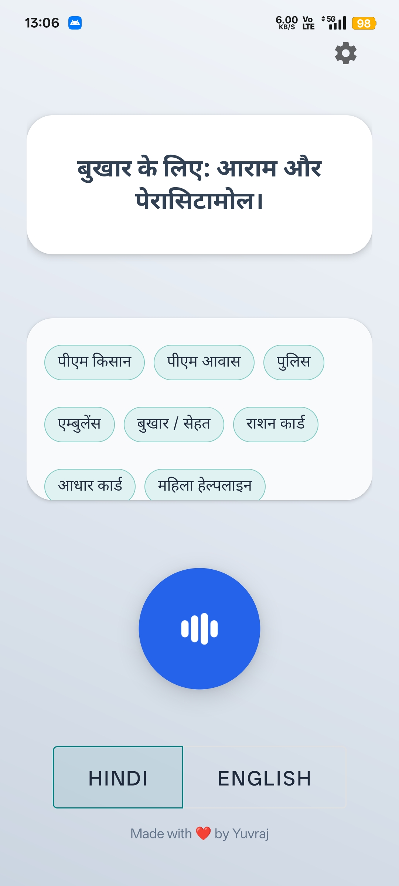
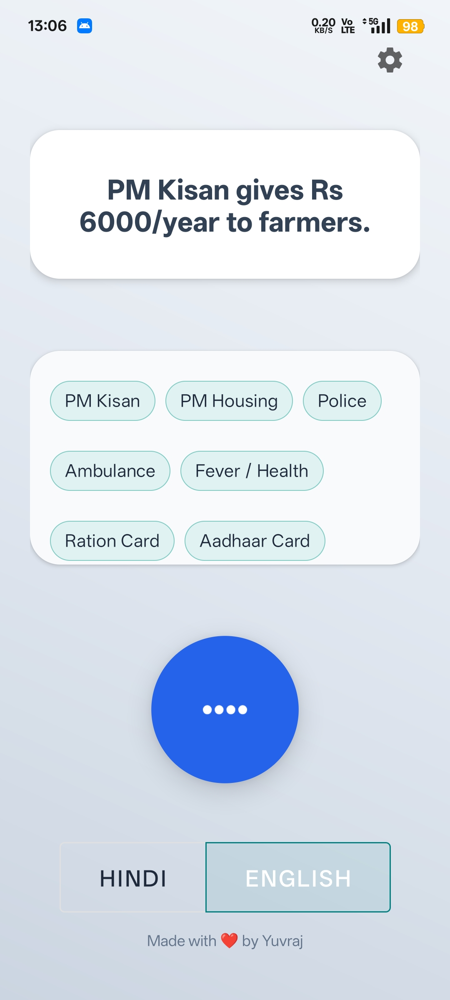
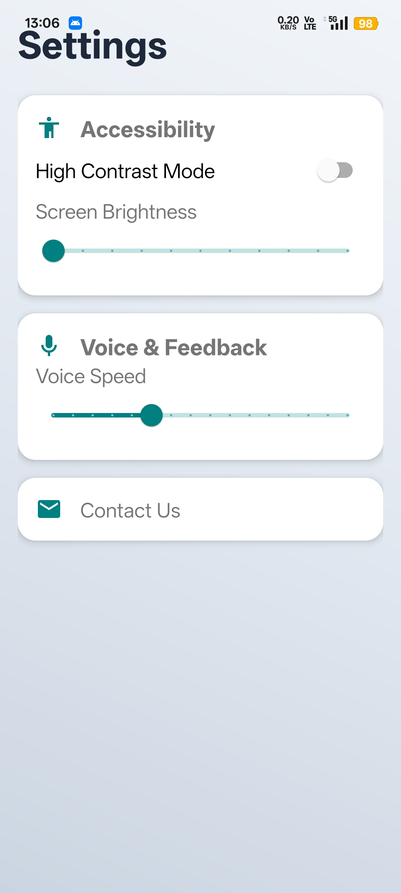

# 🎙️ Sarthi (सारथी)
### *Empowering Bharat: The Offline-First Bilingual Voice Bridge*

[](https://github.com/Yuvraj1954/Sarthi)
[](https://developer.android.com/)
[](https://opensource.org/licenses/MIT)

---

## 📺 Project Showcase
**Sarthi** is a native Android assistant built to solve the "Connectivity Gap" in rural India. It provides life-critical information via voice, even when the internet is completely unavailable.

### [🎥 Watch the Demo Video](https://www.youtube.com/shorts/b9R8nyTjsQw)

---

## 📱 App Walkthrough
| Interface | Healthcare Info | Govt Schemes | Settings |
| :---: | :---: | :---: | :---: |
|  |  |  |  |
| *Bilingual Entry* | *Instant Health Tip* | *Scheme Details* | *Non Tech Friendly* |

---

## 💡 The Problem: The "Triple Barrier"
In rural India, 300M+ users face:
1. **The Literacy Barrier:** Text-heavy apps are unusable for many.
2. **The Language Barrier:** Information is rarely available in local dialects.
3. **The Connectivity Barrier:** 4G/5G is unreliable; apps fail in "Data-Dark" zones.

**Sarthi is the solution.** It turns a smartphone into a talking companion that doesn't need a stable signal to save a life.

---

## 🚀 Key Technical Features

### 📡 1. Resilient Offline Architecture
Unlike standard AI assistants that require an API call for every word, Sarthi uses:
* **On-Device STT:** Local Speech-to-Text processing.
* **Room Database:** A pre-loaded local "Knowledge Bank" of essential services.
* **Zero-Latency Response:** Instant feedback for medical emergencies and scheme queries.

### 🔄 2. Intelligent Cloud Synchronization
Built using the **Android WorkManager API**, Sarthi intelligently queues user interactions. The moment a 2G/3G connection is detected, it background-syncs data without interrupting the user experience.

### 🗣️ 3. Bilingual NLP Logic
Engineered to understand **Hinglish** (Hindi + English mixed), ensuring the UI feels natural to users who don't speak formal "pure" languages.

---

## 🛠️ Built With
* **Language:** Kotlin / Java
* **Database:** SQLite with Room Persistence Library
* **Background Processing:** WorkManager API
* **Voice Engine:** Android SpeechRecognizer & Text-To-Speech (TTS)
* **Architecture:** MVVM (Model-View-ViewModel) for scalability

---

## 🔧 Installation & Setup
1. Clone the repository:
   ```bash
   git clone [https://github.com/Yuvraj1954/Sarthi.git](https://github.com/Yuvraj1954/Sarthi.git)
   ```
   
2. Open the project in Android Studio.

3. Build the APK and install it on an Android device (API 21+).

4. Important: Grant Microphone and Storage permissions for offline functionality.

---

## 🛣️ Roadmap & Future Vision

We are committed to making **Sarthi** the primary assistant for rural India. Our development plan includes:

- [x] **Phase 1:** Core Offline Speech-to-Text (STT) & Intent Mapping.
- [x] **Phase 2:** Bilingual Support (Hindi + English) for Health & Schemes.
- [x] **Phase 3:** Native Android Optimization for low-end hardware.
- [ ] **Phase 4:** **Voice-to-Form Automation** (Users speak, Sarthi fills out Govt application forms).
- [ ] **Phase 5:** **Hyper-Local Dialects** (Support for Bhojpuri, Haryanvi, and Maithili).
- [ ] **Phase 6:** **On-Device LLMs** (Integrating lightweight models like Gemini Nano for complex reasoning without 4G).

---

## 👤 Developed By

**Yuvraj**
*Full-Stack Developer & Social Innovation Enthusiast*
> **"Building technology that speaks the language of the people, not just the code of the machines."**

---
